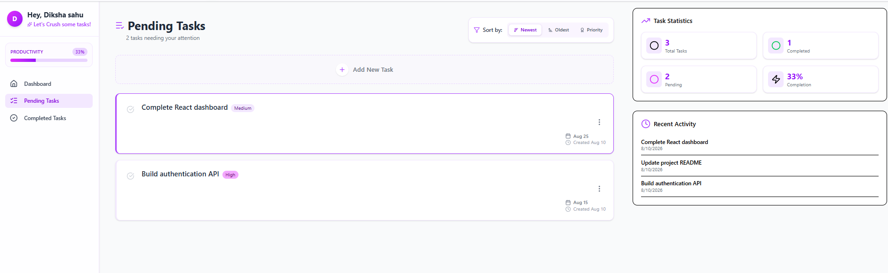
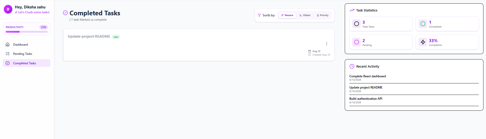
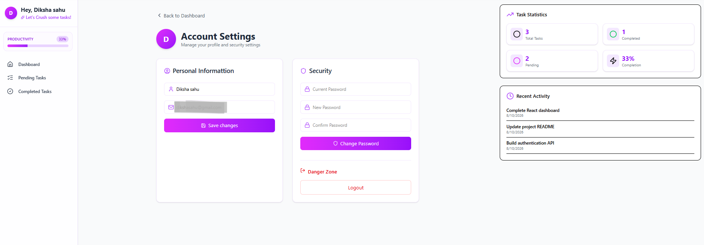

# TaskFlow 🚀

A full-stack task management application built with the MERN stack that helps users create, organize, track, and manage their tasks efficiently.

## ✨ Features

### 🔐 Authentication
- User registration and login
- JWT-based authentication
- Protected routes
- User profile management

### 📋 Task Management
- Create tasks
- Edit tasks
- Delete tasks
- Mark tasks as completed
- Track pending and completed tasks

### 🎯 Task Organization
- Low, Medium, and High priority
- Due date management
- Task sorting
- Task filtering
- Separate Pending and Completed task views

### 📊 Dashboard
- Total task statistics
- Pending task statistics
- Completed task statistics
- Priority-based task statistics
- Recent activity tracking
- Productivity overview

### 👤 Account Management
- View and update profile information
- Change password
- Secure logout

## 🛠️ Tech Stack

### Frontend
- React.js
- JavaScript
- HTML5
- CSS3

### Backend
- Node.js
- Express.js
- REST API
- JWT Authentication

### Database
- MongoDB
- Mongoose

### Tools
- Git
- GitHub
- VS Code
- Thunder Client

## 📸 Screenshots

### Dashboard


### Create New Task


### Pending Tasks



### Completed Tasks



### Account Settings


## 📁 Project Structure

```text
TaskFlow/
│
├── backend/
│   ├── config/
│   ├── controllers/
│   ├── middleware/
│   ├── models/
│   ├── routes/
│   └── server.js
│
├── frontend/
│   ├── public/
│   └── src/
│       ├── assets/
│       ├── components/
│       ├── pages/
│       ├── App.jsx
│       └── main.jsx
│
├── screenshots/
│   ├── dashboard.png
│   ├── create-task.png
│   ├── pending-tasks.png
│   └── completed-tasks.png
│
├── .gitignore
└── README.md
