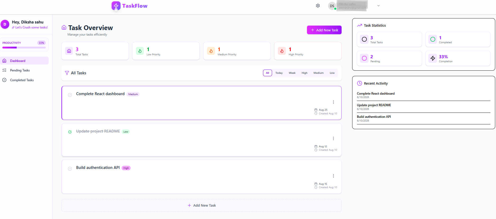
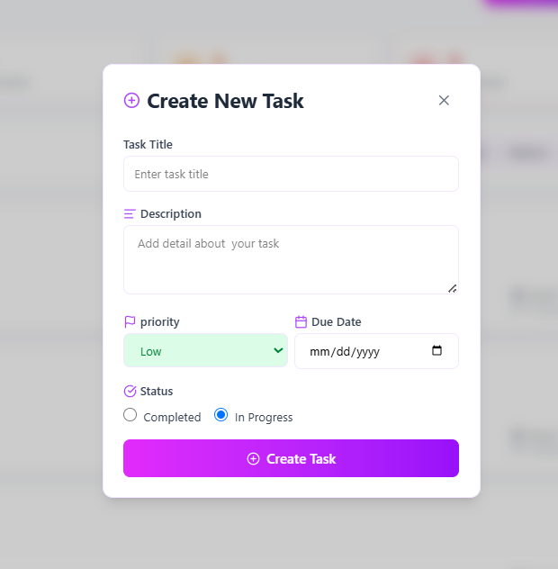

# 🚀 TaskFlow - Task Management Application

TaskFlow is a full-stack task management application built using the MERN stack. It allows users to securely register, log in, create and manage tasks, update task status, and organize their daily work efficiently.

## 🌐 Live Demo

🔗 https://taskflow-gnut.onrender.com

## 📂 GitHub Repository

🔗 https://github.com/dikshashu241/taskflow

---

## ✨ Features

- 🔐 User Registration & Login
- 🔒 JWT-based Authentication
- 📝 Create, Edit and Delete Tasks
- ✅ Mark Tasks as Completed
- ⏳ Manage Pending Tasks
- 🎯 Task Priority Management
- 👤 User Profile Management
- 📊 Dashboard for Task Overview
- 📱 Responsive User Interface
- 🔄 Real-time task data fetching through REST APIs

---

## 🛠️ Tech Stack

### Frontend
- React.js
- JavaScript
- Tailwind CSS
- React Router
- Axios
- Lucide React
- Date-fns

### Backend
- Node.js
- Express.js
- MongoDB
- Mongoose
- JWT Authentication
- bcrypt
- REST APIs

### Tools
- Git
- GitHub
- VS Code
- Render
- MongoDB

---

## 📸 Screenshots

### 🔐 Login


### 📝 Dashboard



### ➕ Create Task



### ⏳ Pending Tasks


### ✅ Completed Tasks


### 👤 Profile


---

## 🔑 Authentication

TaskFlow uses JWT-based authentication to protect user-specific data.

The authentication flow includes:

1. User registration
2. Secure password hashing
3. User login
4. JWT token generation
5. Token-based authorization
6. Protected API routes

---

## 📋 Task Management

Users can:

- Create new tasks
- Add task descriptions
- Set task priority
- Set task deadlines
- Edit existing tasks
- Delete tasks
- Mark tasks as completed
- View pending tasks
- View completed tasks

---

## 📊 Dashboard

The dashboard provides users with an overview of their tasks and allows them to quickly access task-related functionality.

Users can easily navigate between:

- All Tasks
- Pending Tasks
- Completed Tasks
- Profile

---

## ⚙️ API Integration

The frontend communicates with the Node.js/Express backend using REST APIs and Axios.

### Backend API

```text
https://taskflow-backend-p23i.onrender.com